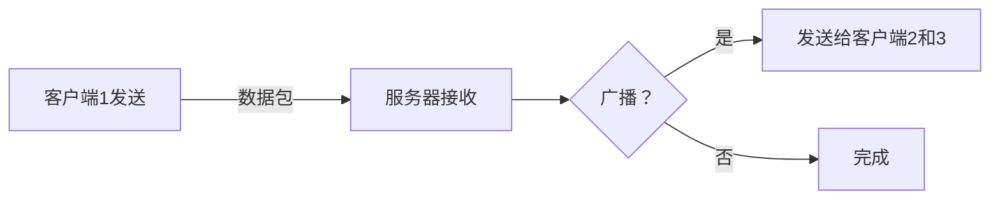

# 创建Fika兼容的模组

## Fika事件

Fika有很多事件可以订阅，这使得在突袭的某些关键时刻运行代码变得更加容易。要订阅事件，请使用：


```cs
/// <summary>
/// 订阅特定类型的Fika事件。
/// </summary>
/// <typeparam name="TEvent">要订阅的事件类型。</typeparam>
/// <param name="callback">分派事件时调用的回调函数。</param>
public static void SubscribeEvent<TEvent>(Action<TEvent> callback) where TEvent : FikaEvent
```


要取消订阅，请使用：


```cs
/// <summary>
/// 从特定类型的Fika事件中取消订阅回调。
/// </summary>
/// <typeparam name="TEvent">要取消订阅的事件类型。</typeparam>
/// <param name="callback">要从事件订阅中移除的回调函数。</param>
public static void UnsubscribeEvent<TEvent>(Action<TEvent> callback) where TEvent : FikaEvent
```


触发的事件通常会传递一个与事件相关的重要对象，例如 `FikaNetworkManagerCreatedEvent` 传递一个 `IFikaNetworkManager`（在对象中名为 `Manager`）。此对象可以在需要时访问。

您可以在[这里](https://github.com/project-fika/Fika-Plugin/tree/main/Fika.Core/Modding)阅读源代码以找到所有事件。

## 注册数据包

要注册数据包，请订阅 `FikaNetworkManagerCreatedEvent` 并访问 `IFikaNetworkManager`。在管理器中您可以调用以下方法之一：


```cs
/// <summary>
/// 将数据包注册到 <see cref="NetPacketProcessor"/>。
/// </summary>
/// <typeparam name="T">数据包类型。</typeparam>
/// <param name="handle">接收数据包时运行的 <see cref="Action"/>。</param>
void RegisterPacket<T>(Action<T> handle) where T : INetSerializable, new();
```


<pre class="language-cs" data-overflow="wrap" data-full-width="false"><code class="lang-cs">/// &#x3C;summary>
/// 将数据包和用户数据注册到 &#x3C;see cref="NetPacketProcessor"/>。
/// &#x3C;/summary>
/// &#x3C;typeparam name="T">数据包类型。&#x3C;/typeparam>
/// &#x3C;typeparam name="TUserData">用户数据类型。&#x3C;/typeparam>
/// &#x3C;param name="handle">接收数据包时运行的 &#x3C;see cref="Action"/>。&#x3C;/param>
<strong>void RegisterPacket&#x3C;T, TUserData>(Action&#x3C;T, TUserData> handle) where T : INetSerializable, new();
</strong></code></pre>

`INetSerializable` 需要是一个您创建的数据包，当接收到该数据包时会调用这些方法。第二种方法还会传递 `NetPeer`，在 `FikaServer` 上很有用。您可以使用这些方法以任何想要的方式处理接收数据包时的逻辑。


未能注册数据包将导致无休止的 `异常` 被抛出。请正确注册您的数据包！


## 创建数据包

要创建数据包，请将 `INetSerializable` 接口实现到新的 `class` 中。对于经常发送的数据包，我强烈建议使用 `struct`。以 `Field` 的形式添加您需要的数据，并将它们全部设为 `Public`。使用 `Serialize()` 和 `Deserialize()` 方法来写入/读取数据。您可以[在这里](https://github.com/project-fika/Fika-Plugin/blob/main/Fika.Core/Networking/Packets/Communication/BotStatePacket.cs)找到一个示例，其中还包含如何编写 `enum`。还有许多用于写入EFT/Unity特定数据（例如 `Vector3`）的扩展程序，您可以在[这里](https://github.com/project-fika/Fika-Plugin/blob/main/Fika.Core/Networking/FikaSerializationExtensions.cs)找到。

不要在经常发送的数据包中实例化和发送新集合，例如 `List<T>` 或 `T[]`。分配会变得昂贵。Fika有一个接口 `IReusable`，您可以使用它来重复使用数据包的单个实例，仅改变其中存在的集合。


```csharp
/// <summary>
/// 使用用户数据将可重用数据包注册到 <see cref="NetPacketProcessor"/>。可重用在 <see cref="NetManager"/> 的整个生命周期内使用相同的实例。
/// 自定义类型必须首先使用 <see cref="RegisterCustomType{T}(Action{NetDataWriter, T}, Func{NetDataReader, T})"/> 注册。
/// </summary>
/// <typeparam name="T">数据包类型。</typeparam>
/// <typeparam name="TUserData">用户数据类型。</typeparam>
/// <param name="handle">接收数据包时运行的 <see cref="Action"/>。</param>
void RegisterReusable<T, TUserData>(Action<T, TUserData> handle) where T : class, IReusable, new();
```


这些数据包的示例可以在[这里](https://github.com/project-fika/Fika-Plugin/blob/47a9d37aa40e2e7cc0b9628c7114115cd3805cd4/Fika.Core/Networking/Packets/World/WorldPacket.cs)找到。在某个地方创建类，跟踪它并重复使用它。您可以在[FikaClientWorld](https://github.com/project-fika/Fika-Plugin/blob/47a9d37aa40e2e7cc0b9628c7114115cd3805cd4/Fika.Core/Main/ClientClasses/FikaClientWorld.cs)中找到示例。

## 发送数据包

要发送数据包，您需要一个 `IFikaNetworkManager`。这可以是 `FikaServer` 或 `FikaClient`，您可以通过 `Comfort.Common` 命名空间使用 `Singleton<IFikaNetworkManager>.Instance` 来访问。要确定您是服务器还是客户端，请使用 `FikaBackendUtils.IsServer`。

使用此方法发送数据包：


```cs
/// <summary>
/// 发送数据包。
/// </summary>
/// <typeparam name="T">要发送的数据包类型，必须实现<see cref="INetSerializable"/>。</typeparam>
/// <param name="packet">要发送的数据包实例，按引用传递。</param>
/// <param name="deliveryMethod">用于发送数据包的传递方法（可靠、不可靠等）。</param>
/// <param name="broadcast">如果为<see langword="true"/>，数据包将发送给多个接收者；否则将发送给单个目标（服务器始终是广播）。</param>
void SendData<T>(ref T packet, DeliveryMethod deliveryMethod, bool broadcast = false) where T : INetSerializable;
```


`broadcast` 参数决定是否发送给_所有其他客户端_。作为服务器，这始终为 `true`。

如果您只想发送给一个特定的 `NetPeer`，例如在接收数据包后想要响应那个对等端：


```csharp
/// <summary>
/// 直接向特定对等端发送数据包。
/// </summary>
/// <typeparam name="T">要发送的数据包类型，必须实现<see cref="INetSerializable"/>。</typeparam>
/// <param name="packet">要发送的数据包实例，按引用传递。</param>
/// <param name="deliveryMethod">用于发送数据包的传递方法（可靠、不可靠等）。</param>
/// <param name="peer">将接收数据包的目标<see cref="NetPeer"/>。</param>
/// <remarks>
/// 只应作为<see cref="FikaServer"/>使用，因为<see cref="FikaClient"/>只有一个<see cref="NetPeer"/>。
/// </remarks>
void SendDataToPeer<T>(ref T packet, DeliveryMethod deliveryMethod, NetPeer peer) where T : INetSerializable;
```





客户端只有一个 `NetPeer`，它_**始终**_是服务器！客户端永远不会感知到其他客户端。


某些特定函数是类特定的，不能从接口单例调用。您可以使用 `Singleton<FikaServer>.Instance` 等访问特定的 `FikaServer` 或 `FikaClient`。

具体方法如下：

#### 客户端


```csharp
/// <summary>
/// 发送可重用数据包
/// </summary>
/// <typeparam name="T">要发送的<see cref="IReusable"/></typeparam>
/// <param name="packet">要发送的<see cref="INetSerializable"/></param>
/// <param name="deliveryMethod">传递方法</param>
/// <remarks>
/// 从客户端发送时，可重用数据包始终是广播类型
/// </remarks>
public void SendReusable<T>(T packet, DeliveryMethod deliveryMethod) where T : class, IReusable, new()
```


#### 服务器


```csharp
public void SendReusableToAll<T>(T packet, DeliveryMethod deliveryMethod, NetPeer peerToExlude = null) where T : class, IReusable, new()
```


***

## 关于数据的一般信息


请记住，性能和带宽不是免费的！除非必须，否则不要在每次 `Update()` 时发送冗余数据。&#x20;

Fika有一个您可以继承的类叫做 `ThrottledMono`，您可以设置 `UpdateRate`，即每秒更新次数。这可以显著提高性能并减少使用的带宽。


### Calculating Packet Size (UDP with Headers)

When sending data over a network using UDP, each packet consists of:

1. Your payload (the actual data, e.g., floats)
2. Packet-specific overhead (1–4 bytes depending on the type, e.g. `Unreliable` or `ReliableOrdered`)
3. UDP header (8 bytes)
4. IP header (20–60 bytes, depending on IPv4 options)

It’s important to account for all headers, not just the payload, because small payloads can become inefficient due to header overhead.

#### Formula

Let:

* _**N**_ = number of elements being sent
* _**S**_<sub>element</sub> = size of one element in bytes (e.g., 4 bytes for a `float`)
* _**H**_<sub>packet​</sub> = packet-specific overhead (1–4 bytes)
* _**H**_<sub>UDPH​</sub> = UDP header size (8 bytes)
* _**H**_<sub>IPH</sub>​ = IP header size (20–60 bytes)

Then, the **total packet size in bytes** is:

$$
\text{Packet Size (bytes)} = N \times S_{\text{element}} + H_{\text{packet}} + H_{\text{udp}} + H_{\text{ip}}
$$

To convert to **bits**:

$$
\text{Packet Size (bits)} = 8 \times \Big( N \cdot S_{\text{element}} + H_{\text{packet}} + H_{\text{udp}} + H_{\text{ip}} \Big)
$$

***

#### 示例

假设您正在发送一个 `Vector3`，即3个浮点数（每个4字节），加上2字节的数据包特定开销，8字节UDP头部和20字节IP头部：

$$
数据包大小=3×4+2+8+20=42 字节
$$

$$
位数的数据包大小=42×8=336 位
$$

即使这个小有效载荷，如果频繁发送（例如，游戏中的每帧），也会消耗大量带宽。请注意，即使有效载荷只有12字节，头部也会使总数据包大小增加近_**4倍**_。\
\
现在想象这是不受限制的，客户端以120 FPS运行：

<mark style="color:$primary;">我们已经有了：</mark>

$$
数据包大小=42 字节
$$

<mark style="color:$primary;">如果我们每秒发送120个数据包：</mark>

$$
每秒数据（字节）=42×120
$$

#### 逐步分解

* 数据包大小为42字节。
* 每秒发送120个数据包。
* 数据包大小乘以数据包数：42 × 120。

<mark style="color:$primary;">分解计算：</mark>&#x20;

$$
42×120=42×(12×10)=(42×12)×10
$$

$$
42×12=504
$$

$$
504×10=5,040
$$

<mark style="color:$primary;">转换为位数：</mark>

$$
5,040×8=40,320位每秒（bps）
$$

这_**大量**_的带宽和CPU使用是浪费的。除非至关重要，否则不要每tick发送数据。相反，如有需要，在接收端插值。进一步分解：

$$
数据传输=5KB/s×60s=300KB
$$

这只是_**一个**_、_**单独的**_ `Vector3` 每分钟300KB。这几乎等于Fika每分钟为_**所有机器人状态**_发送的带宽的¼。

<mark style="color:$primary;">整个玩家状态的大小（52字节），20/s：</mark>

$$
52×20=1040字节/秒每实体
$$

<mark style="color:$primary;">假设我们有20个机器人：</mark>

$$
1040×20=20,800字节/秒总计
$$

<mark style="color:$primary;">现在每分钟：</mark>

$$
20,800×60=1,248,000字节/分钟≈1,248MB/分钟（1.19 MiB）
$$

***

### 插值

正如您从分解中看到的，有很多可以限制和较少发送的数据，可能通过lerping值并在发送时和接收时比较时间来插值。

<mark style="color:$primary;">插值因子</mark> <mark style="color:$primary;"></mark>_<mark style="color:$primary;">**t**</mark>_<mark style="color:$primary;">：</mark>

$$
t = \frac{\text{当前时间} - \text{发送时间}}{\text{接收时间} - \text{发送时间}}
$$

<mark style="color:$primary;">将</mark> <mark style="color:$primary;"></mark>_<mark style="color:$primary;">**t**</mark>_ <mark style="color:$primary;"></mark><mark style="color:$primary;">限制在0到1之间：</mark>

$$
t = \max(0, \min(1, t))
$$

<mark style="color:$primary;">线性插值公式：</mark>

$$
\text{插值值} = \text{旧值} + (\text{新值} - \text{旧值}) \cdot t
$$

然后您可以发送当前时间（`Time.unscaledTime`）并在接收时与当前时间比较，并使用上述方程平滑差异。

#### 现在比较不同的发送方法

<mark style="color:$primary;">20条消息/秒，每条16字节：</mark>

$$
16 \times 20 = 320\ \text{字节/秒}
$$

<mark style="color:$primary;">120条消息/秒，每条12字节：</mark>

$$
12 \times 120 = 1{,}440\ \text{字节/秒}
$$

<mark style="color:$primary;">即每秒节省\~1080字节：</mark>

$$
1{,}440 - 320 = 1{,}120\ \text{字节/秒}
$$

### 总结

通过将**时间同步**与**基于lerp的平滑处理**相结合，我们可以在不干扰网络的情况下创建流畅、低延迟的运动。\
不是每帧发送完整的定位更新，而是发送包含时间戳的更少消息并在本地插值：

$$
\text{插值值} = (1 - t) \cdot \text{旧值} + t \cdot \text{新值}
$$

这允许客户端基于时间差异而不是原始频率平滑重建运动。

例如，从**120消息/秒，每条12字节**减少到**20消息/秒，每条16字节**节省：

$$
1{,}440 - 320 = 1{,}120\ \text{字节/秒}
$$

虽然每流**1.12 KB/秒**可能看起来很小，但它会快速扩展——每个参与者可以发送多个数据流（位置、旋转、动画状态等），随着参与者数量的增加，节省显著增加。

优化发送频率和有效载荷大小是实现**流畅、高效和可扩展的网络运动**的最有效方法之一。


这种方法不仅适用于运动——对于同步任何基于时间的值同样有用，例如动画、UI转换、物理状态，甚至是音频参数。


## 提示和有用的类

* [FikaBackendUtils](https://github.com/project-fika/Fika-Plugin/blob/main/Fika.Core/Coop/Utils/FikaBackendUtils.cs) 有许多有用的可使用方法/属性/字段。
* [FikaGlobals](https://github.com/project-fika/Fika-Plugin/blob/main/Fika.Core/Coop/Utils/FikaGlobals.cs) 有一些在开发过程中有用的辅助方法。
* [CoopHandler](https://github.com/project-fika/Fika-Plugin/blob/main/Fika.Core/Coop/Components/CoopHandler.cs) 有有用的属性和方法，主要用于跟踪玩家（特别是人类玩家）。可以在 `Singleton<IFikaNetworkManager>.Instance` 或 [CoopHandler.TryGetCoopHandler()](https://github.com/project-fika/Fika-Plugin/blob/18f02d5713b0e13cc02998b9e79489a55ac8249d/Fika.Core/Coop/Components/CoopHandler.cs#L62C40-L62C67) 上访问，具体取决于您的代码样式偏好。
* [FikaSerializationExtensions](https://github.com/project-fika/Fika-Plugin/blob/47a9d37aa40e2e7cc0b9628c7114115cd3805cd4/Fika.Core/Networking/FikaSerializationExtensions.cs) 有许多很好的扩展方法来处理数据，例如打包 `float`。如果精度不重要到小数点后几位，建议打包您的原数据类型。
